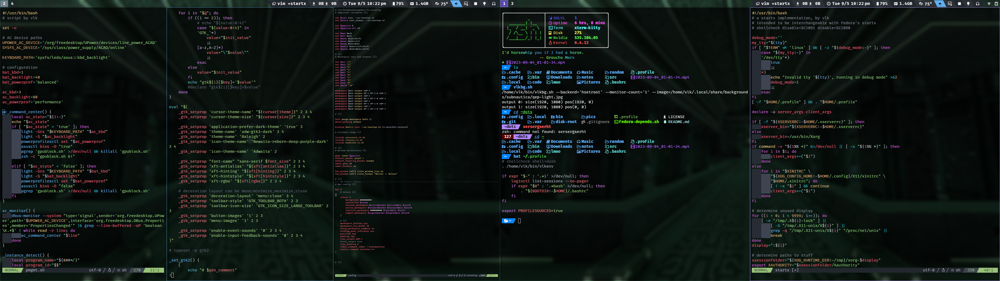
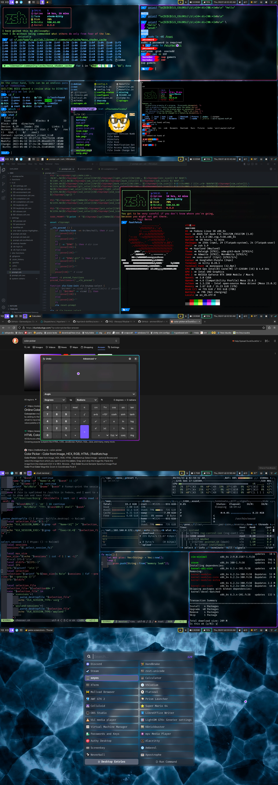

# homescripts

Useful shell scripts and dotfiles for Linux

I currently use these dotfiles on Fedora 38, but my scripts are also mostly compatible with Arch Linux as well.

Included are configs for i3 window manager and the Hyprland compositor, as well as bash/zsh, gtk, picom, nvim, Kitty, rofi, waybar -- basically all the nerd shit TWM users like nowadays.

Don't just clone this repo and copy my config -- *learn* from it. *Experiment*. Whenever you aren't growing, you're dying. (Is that how that saying goes?)

Questions? Write an issue. I doubt those are all that useful for anything else on a dotfiles repo.

# Screenshots

## i3wm

## Hyprland

