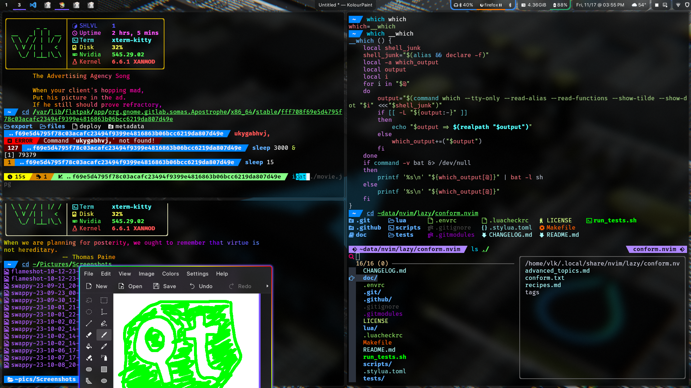
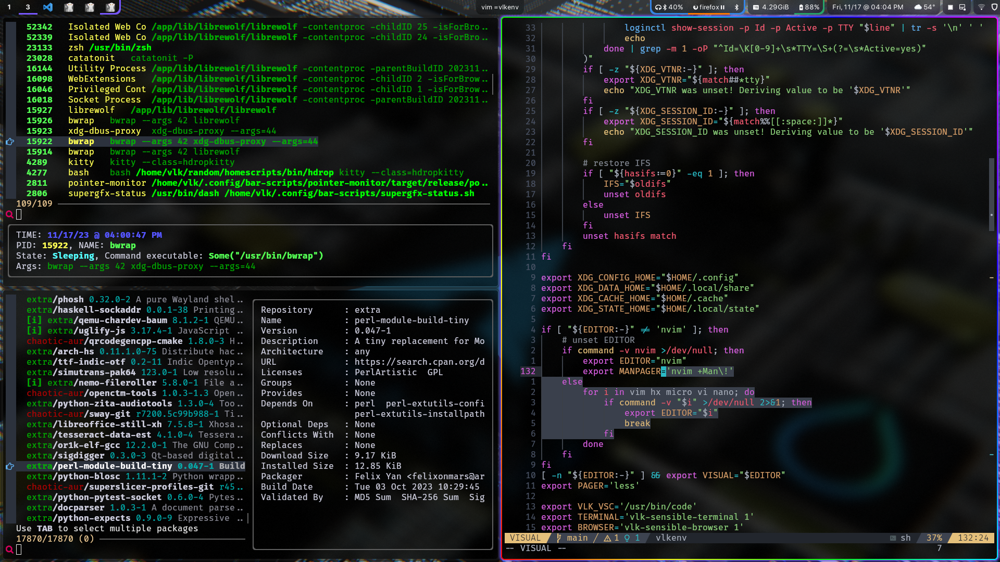
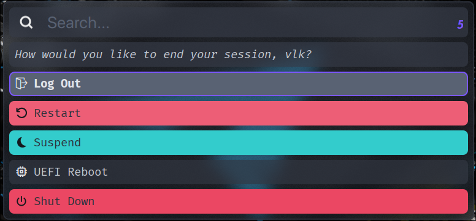
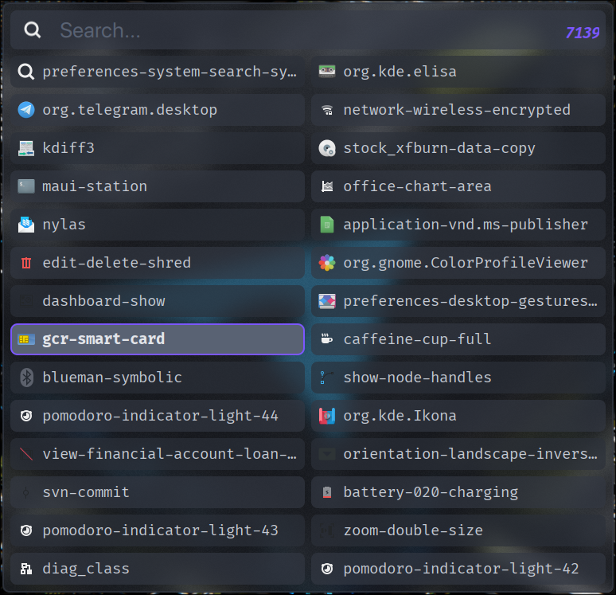
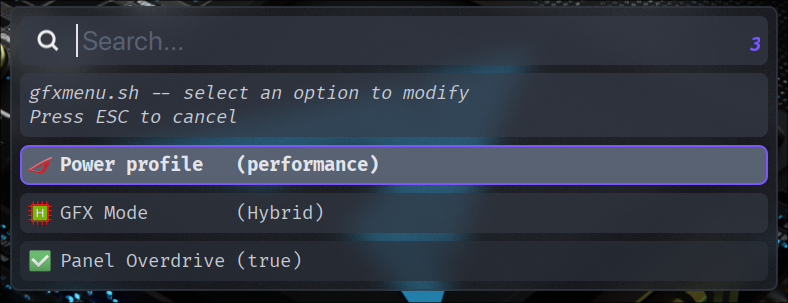
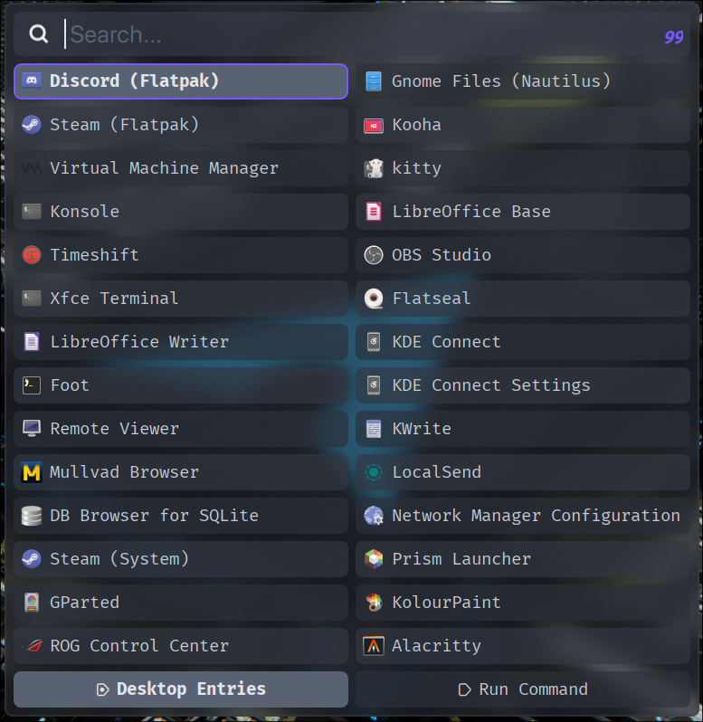
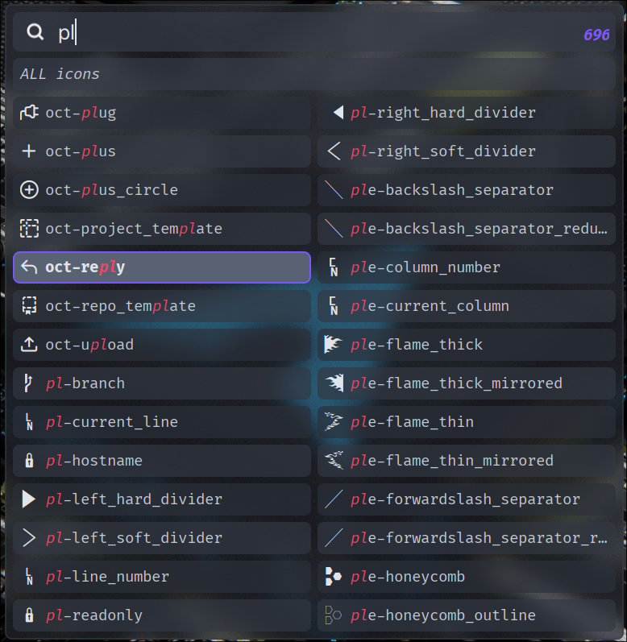

# homescripts

Useful shell scripts and dotfiles for Linux

These dotfiles should be compatible with both Fedora and Arch Linux

-   about 150 or so shell scripts
    -   bin/
    -   .config/bar-scripts/
-   Some rust programs
    -   .config/rustcfg/
    -   .config/shell/
-   a massive zsh config
    -   no plugin manager
    -   Fully custom zsh prompt
-   hyprland, i3, sway configs
-   rofi, kvantum, adw-gtk, kitty, ranger, dir_colors
-   and much more

These dotfiles are not designed to be just copied, but I have taken measures to make them at least not _break_ too much on random systems.

Some config files are meant to be generated programatically (gtk configs, fontconfig, dconf, xsettingsd)

Questions? Write an issue. I doubt those are all that useful for anything else on a dotfiles repo.

# Desktop screenshots

-   A screenshot showing off my shell config as well as my Kvantum theme (Included)

-   A screenshot showing off [psa](.config/rustcfg/psa/), [pacs.pl](bin/pacs.pl), and my [nvim config](.config/nvim/init.lua) that has working multi-clipboard functionality.

## Rofi

-   my Rofi power menu, a script that uses Rofi's built-in scripting "ABI"
-   `rofi -show powermenu`

-   A GTK Icon selector that shows all available icons in the current GTK3 theme
-   `bin/gtk-icon-rofi.py`

-   A graphics menu to replace the functionality of Asus Armory Crate
-   `bin/gfxmenu.sh`

-   My Desktop menu, showing some custom .desktop file modifications
-   `rofi -modi drun,run -show drun -sidebar-mode`

-   A nerd font selector I made, with copy and insert functionality. Works on both X11 (xclip, xdotool) and Wayland (wl-copy, wtype)
-   `bin/nerd-rofi.sh`

